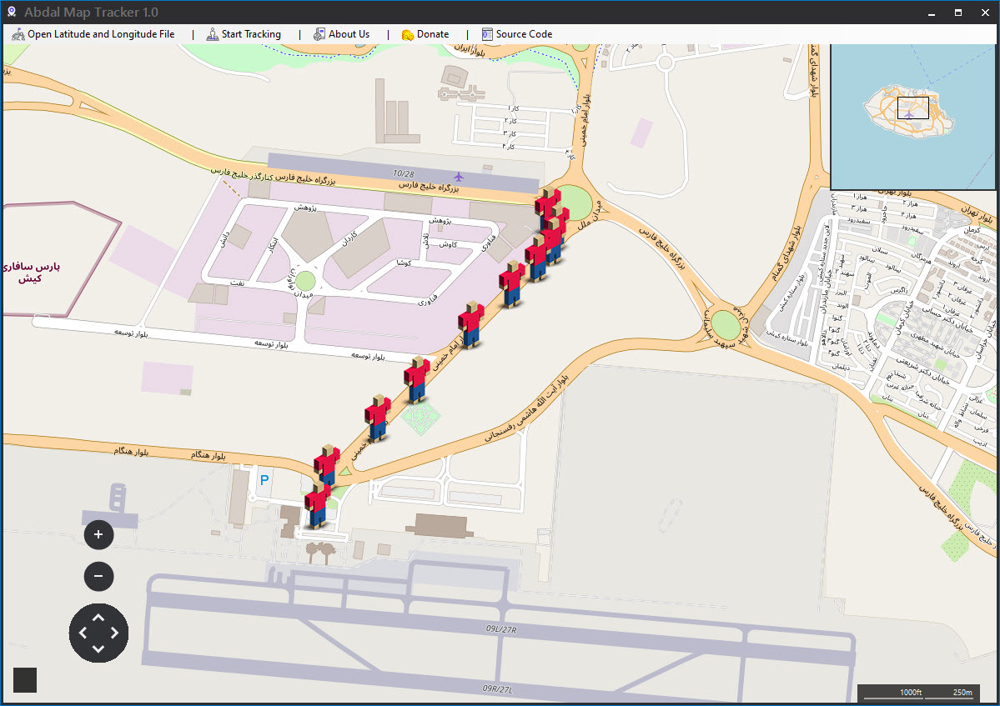

# Abdal Map Tracker

## Screenshot

## Made For

Display people's or device transit routes based on latitude and longitude graphically

**Requires**
> Visual Studio 2019 - Telerik WinForm - .NetFramework 4.7.*
>

Features

- caching support
- clean code
- Beautiful appearance
- installation package
- OpenStreetMap support
- No malware
- Open Source
- high speed

**How To create Geographic coordinate  file ?**

it's easy, just create a txt file and put  latitude longitude per line like :

26.547371,53.983546

## ❤️ Donation
> Donate link: https://donate.abdalagency.ir/

## Reporting Issues 

If you are facing a configuration issue or something is not working as you expected to be, please use the **Abdal.Group@Gmail.Com** or **Prof.Shafiei@Gmail.com** . Issues on GitLab are also welcomed.

### About Programmer
Ebrahim Shafiei (EbraSha) (Ready to cooperate with international projects)
- Email : Prof.Shafiei@Gmail.com

## License
Abdal Map Tracker is open-source software licensed under the [MIT license.](https://choosealicense.com/licenses/mit/)

## ⚠️ Legal disclaimer ⚠️

Usage of Abdal Map Tracker for Spying targets without prior mutual consent is illegal. It's the end user's responsibility to obey all applicable local, state and federal laws. Developers assume no liability and are not responsible for any misuse or damage caused by this program.

